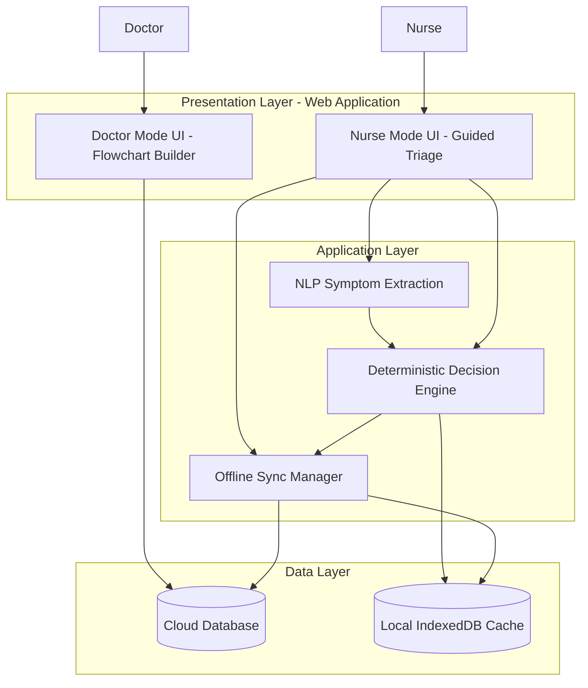
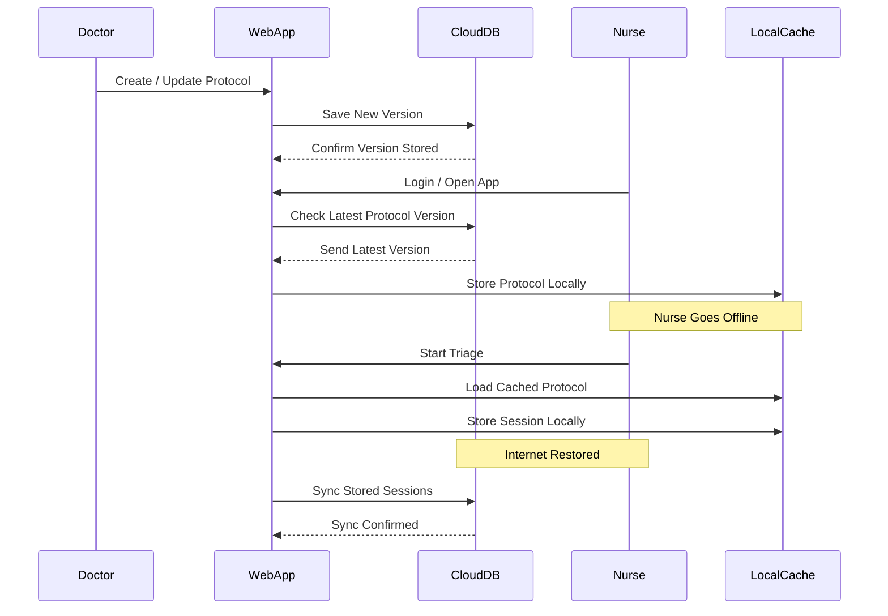
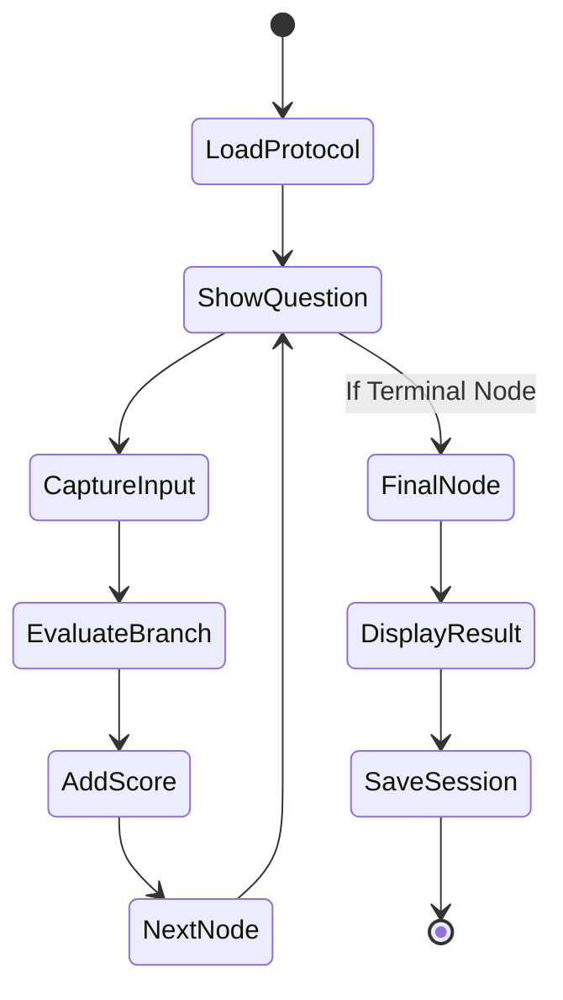
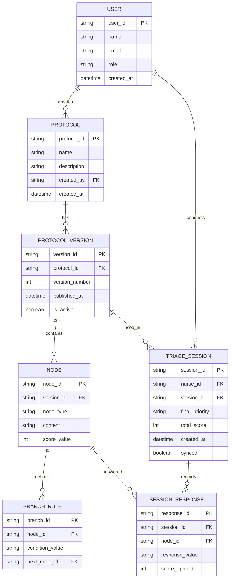

# CareTree: Modular Clinical Decision Support Framework

## One-line Project Description

An offline-syncable, rule-based triage framework that enables doctors to visually design customizable decision-tree protocols and empowers nurses with step-by-step guided triage execution, enhanced by NLP-assisted symptom extraction.

---

# 1. Problem Statement

## Problem Title  
Inflexible and Non-Adaptive Triage Systems in Resource-Constrained Healthcare Settings

## Problem Description  

In primary care clinics, rural health centers, and field healthcare programs, frontline patient assessment is often conducted by nurses or community health workers rather than specialized physicians.

Most existing triage systems rely on:

- Static paper-based flowcharts  
- Manual checklists  
- Hardcoded digital systems  
- Non-configurable decision trees  

These systems are:

- Difficult to update across distributed clinics  
- Hard to navigate during high-pressure situations  
- Not adaptable to regional or clinic-specific needs  
- Dependent on stable internet connectivity  
- Lacking structured scoring flexibility  

As a result, triage decisions become inconsistent, slower, and prone to human error — especially in high-volume or low-connectivity environments.

---

## Target Users  

- Nurses and paramedics  
- Community health workers  
- Primary Health Centers (PHCs)  
- Rural clinics  
- Field health programs  
- Medical supervisors and protocol designers  

---

## Existing Gaps  

- No modular triage builder tailored for frontline healthcare  
- Limited offline-syncable digital decision tools  
- Poor protocol version control and update mechanisms  
- Lack of assistive tools for rapid symptom input  
- Rigid scoring systems that cannot be customized  

---

# 2. Problem Understanding & Approach

## Root Cause Analysis  

The inefficiencies in frontline triage stem from:

- Static protocol distribution (manual or paper-based updates)  
- Cognitive overload when navigating complex symptom trees  
- Lack of digital infrastructure optimized for low-connectivity regions  
- No clear separation between protocol design and execution  

Existing tools either focus on diagnosis instead of structured triage or require continuous internet access, making them unreliable in rural settings.

---

## Solution Strategy  

Our approach focuses on:

1. Designing a configurable rule-based decision engine instead of hardcoded logic  
2. Separating Doctor Protocol Design Mode from Nurse Execution Mode  
3. Implementing an offline-syncable web architecture  
4. Enhancing usability with NLP-assisted symptom extraction  
5. Maintaining deterministic, explainable triage logic  

The system prioritizes usability, modularity, and reliability.

---

# 3. Proposed Solution

## Solution Overview  

CareTree is a unified, role-based clinical decision support platform designed to simplify both protocol creation and triage execution.

It addresses two major usability gaps:

- Doctors struggle to modify and distribute structured triage pathways.  
- Nurses struggle to navigate complex symptom trees under time pressure.  

CareTree solves both by providing:

- A visual, modular flowchart builder for doctors.  
- A guided, step-by-step triage interface for nurses.  

---

## Core Idea  

Instead of static paper flowcharts or rigid digital checklists, CareTree introduces a configurable decision-tree framework where:

- Doctors visually build and modify triage pathways using intuitive flowchart logic.  
- Nurses follow a guided, interactive triage sequence that dynamically presents only the relevant next question.  
- The engine automatically determines the next step based on previous inputs.  
- Risk scoring and urgency classification are handled deterministically.  
- Offline synchronization ensures uninterrupted use in low-connectivity environments.  

The focus is not just digitalization — but reducing cognitive load and improving clarity during patient assessment.

---

## Key Features  

### 🩺 For Doctors (Protocol Builder Ease)

- Visual flowchart-based protocol creation  
- Drag-and-drop node management  
- Easy conditional branching definition  
- Editable scoring and priority assignment  
- Version-controlled updates  
- No need to rewrite or redistribute paper guides  
- Rapid protocol modification without technical coding  

Doctors can adapt triage logic in minutes instead of redesigning static manuals.

---

### 👩‍⚕️ For Nurses (Execution Ease)

- Guided step-by-step questioning  
- Automatic next-step navigation  
- Clear urgency classification output  
- Structured recommendations at terminal nodes  
- Reduced need to manually interpret flowcharts  
- Offline functionality during network loss  

Instead of searching through complex charts, nurses are simply guided to the next logical question automatically.

This reduces:

- Decision fatigue  
- Navigation errors  
- Time-to-classification  

---

# 4. System Architecture

## High-Level Flow

### Doctor Workflow  
Design Flowchart → Define Logic → Assign Scores → Publish Protocol → Automatic Sync to Nurse Devices  

### Nurse Workflow  
Select Protocol → Enter Patient Data → Follow Guided Questions → View Clear Priority & Recommendation → Log Session → Auto-Sync  

---

## Standard Architecture Flow  

User → Frontend → Backend → Decision Engine → Database → Response  

---

## Architecture Description  

The system follows a layered, cloud-synchronized architecture:

### 1️⃣ Presentation Layer  
- Web-based UI  
- Role-based dashboards (Doctor Mode / Nurse Mode)  

### 2️⃣ Application Layer  
- Deterministic Decision Engine (State Machine)  
- NLP Symptom Extraction Module  
- Offline Sync Manager  

### 3️⃣ Data Layer  
- Cloud Database (Protocols, Versions, Logs)  
- Local IndexedDB (Offline caching & session storage)  

### 4️⃣ Sync Mechanism  
- Version check during login  
- Automatic protocol download and caching  
- Local session storage during offline mode  
- Automatic synchronization when connectivity is restored  

---

## Architecture Diagram  

---

---

---

# 5. Database Design

## ER Diagram  

---

## ER Diagram Description  

Main Entities:

- **User** (Doctor / Nurse)  
- **Protocol**  
- **ProtocolVersion**  
- **Node** (Question / Action)  
- **BranchRule** (Conditional Logic)  
- **TriageSession**  
- **SessionResponse**  

Relationships:

- One Protocol → Many Versions  
- One Version → Many Nodes  
- One Triage Session → Many Responses  
- One User → Many Sessions  

This schema ensures version control, structured logging, and scalable protocol management.

---

# 6. Dataset Selected

## Dataset Name  
Synthetic Symptom Text Dataset  

## Source  
Generated using structured medical symptom dictionaries and publicly available references  

## Data Type  
Unstructured free-text symptom descriptions mapped to structured symptom labels  

## Selection Reason  
Due to privacy constraints and lack of publicly available patient-level triage datasets, a synthetic dataset was created to train and validate the NLP-based symptom extraction module in CareTree.

## Preprocessing Steps  

- Tokenization  
- Lowercasing  
- Stop-word removal  
- Symptom dictionary mapping  
- Regex-based duration extraction  
- Severity keyword detection  

---

# 7. Model Selected

## Model Name  
Lightweight NLP-based Named Entity Recognition (NER) / Rule-assisted extraction model  

## Selection Reasoning  

- Optimized for browser deployment  
- Supports offline execution  
- Designed strictly for symptom extraction  
- Low computational overhead  
- Compatible with offline-sync architecture  

## Alternatives Considered  

- Transformer-based medical language models  
- Heavy deep-learning NER systems  

Rejected due to deployment complexity, performance overhead, and resource constraints.

## Evaluation Metrics  

- Precision (Correct symptom detection rate)  
- Recall (Coverage of symptom mentions)  
- F1 Score  
- Extraction latency  

---

# 8. Technology Stack  

CareTree is built using a modern full-stack web architecture designed for modularity, scalability, and offline resilience.

---

## Frontend  

- **React.js** – Component-based UI framework for building Doctor and Nurse interfaces  
- **React Flow** – Visual drag-and-drop flowchart builder for protocol creation  
- **Tailwind CSS** – Utility-first styling framework for clean, responsive UI  
- **Axios** – API communication between frontend and backend  
- **IndexedDB (via idb library)** – Local storage for offline protocol caching and triage sessions  
- **Service Workers** – Offline support and background sync handling  

---

## Backend  

- **Node.js** – Runtime environment  
- **Express.js** – REST API server  
- **JWT (JSON Web Tokens)** – Role-based authentication (Doctor / Nurse)  
- **Mongoose** – ODM for MongoDB  
- **Versioning Logic Layer** – Custom implementation for protocol version control  
- **Decision Engine (Custom Rule-Based State Machine)** – Deterministic triage execution  

---

## Database  

- **MongoDB (Cloud-hosted)** – Stores:
  - Protocols
  - Protocol versions
  - Nodes & branching rules
  - Users
  - Triage session logs  

- **IndexedDB (Browser Local Storage)** – Stores:
  - Cached protocol versions
  - Offline triage sessions
  - Sync flags  

---

## ML / NLP Module  

- **Python (FastAPI Microservice) OR Node-based NLP module**  
- **spaCy (Lightweight NER model)** – Symptom entity extraction  
- **Custom Symptom Dictionary Mapping** – Maps extracted entities to structured inputs  
- **Regex-based Parsing** – Duration & severity detection  

(Optimized for lightweight deployment and offline compatibility)

---

## Deployment  

- **Frontend Deployment:** Vercel / Netlify  
- **Backend Deployment:** Render / Railway / AWS EC2  
- **Database Hosting:** MongoDB Atlas  
- **Environment Management:** dotenv  

---

## Architecture Pattern  

- RESTful API Architecture  
- Role-Based Access Control (RBAC)  
- State Machine-Based Decision Engine  
- Offline-First with Sync-on-Reconnect Model  
- Version-Controlled Protocol Management  

---

## Development Tools  

- Git & GitHub – Version control  
- Postman – API testing  
- Thunder Client – API validation  
- VS Code – Development environment  
---

# 9. API Documentation & Testing  

## API Endpoints List  

### 1. Create / Update Protocol  
Used by doctors to publish new protocol versions.

### 2. Fetch Latest Protocol Version  
Used by nurse application to sync the latest active protocol.

### 3. Submit Triage Session  
Stores completed triage results in the cloud database.

### 4. Sync Offline Logs  
Uploads locally stored sessions once connectivity is restored.

> (Add Postman / Thunder Client screenshots here)

---

# 10. Module-wise Development & Deliverables  

## Checkpoint 1: Research & Planning  
**Deliverables:**
- System architecture design  
- ER schema design  
- Workflow documentation  

## Checkpoint 2: Backend Development  
**Deliverables:**
- Decision engine implementation  
- Protocol versioning logic  
- API endpoints  

## Checkpoint 3: Frontend Development  
**Deliverables:**
- Doctor flowchart builder UI  
- Nurse guided triage UI  
- Role-based authentication  

## Checkpoint 4: Model Training  
**Deliverables:**
- Synthetic dataset generation  
- NLP extraction pipeline  

## Checkpoint 5: Model Integration  
**Deliverables:**
- NLP module integration with decision engine  
- Confirmation UI for extracted symptoms  

## Checkpoint 6: Deployment  
**Deliverables:**
- Cloud deployment  
- Offline sync validation  
- Protocol version testing  

---

# 11. End-to-End Workflow  

1. Doctor logs into CareTree and creates or updates a triage protocol.  
2. Protocol is versioned and stored in the cloud.  
3. Nurse device syncs the latest protocol version automatically.  
4. Nurse selects protocol and enters patient symptoms (structured or free-text).  
5. NLP module extracts structured symptom data.  
6. Decision engine navigates the flowchart dynamically.  
7. Risk score is calculated deterministically.  
8. Urgency classification and recommended action are displayed.  
9. Session is stored locally if offline.  
10. Data is synchronized automatically when internet reconnects.  

---

# 12. Demo & Video  

- **Live Demo Link:**  
- **Demo Video Link:**  
- **GitHub Repository:**  

---

# 13. Hackathon Deliverables Summary  

- Modular rule-based triage engine  
- Doctor-configurable visual flowchart builder  
- Nurse-facing guided execution interface  
- Cloud-sync architecture with offline support  
- NLP-assisted symptom extraction module  

---

# 14. Team Roles & Responsibilities  

| Member Name | Role | Responsibilities |
|-------------|------|-----------------|
| Arkapravo Rajkonwar | System Architect | Architecture & Backend |
| Rishi Seth | System Architect + Frontend Developer | Backend & UI Development |
| Vinayak Mohakud | ML Engineer + Frontend Developer | NLP Module & UI Development |

---

# 15. Future Scope & Scalability  

## Short-Term  

- Multi-language symptom extraction  
- Improved NLP accuracy  
- Analytics dashboard for supervisors  

## Long-Term  

- ML-based risk calibration  
- Regional triage protocol templates  
- Public health trend detection  
- Standalone exportable runtime package  

---

# 16. Known Limitations  

- NLP module trained on synthetic dataset  
- Requires initial internet connection for protocol synchronization  
- Not a diagnostic system  
- Decision quality depends on protocol design  

---

# 17. Impact  

CareTree transforms frontline patient assessment by:

- Making protocol design modular and intuitive for medical supervisors  
- Converting complex decision trees into guided, interactive workflows  
- Reducing ambiguity in early-stage triage decisions  
- Improving speed and consistency of patient prioritization  
- Enabling reliable operation in low-connectivity environments  

CareTree shifts triage from static reference charts to an adaptive, structured decision-support experience.

---
